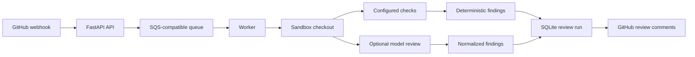

# AI Code Reviewer

[](https://github.com/shaversj/code-review/actions/workflows/ci.yml)


[](LICENSE)

A single-tenant GitHub App service for automated pull request review.

The project demonstrates a production-shaped review service: FastAPI webhook ingestion, GitHub App authentication, queued review jobs, sandboxed checkout, deterministic checks, optional model-backed review, SQLite run history, and GitHub review publishing.

## Try It

```bash
uv sync --extra dev
uv run pytest -q
uv run ruff check .
```

Or run the full local verification script:

```bash
./init.sh
```

## What To Notice

- Webhook ingestion is separated from review execution.
- Review jobs move through a queue rather than running directly inside the webhook request.
- The deterministic pipeline can run without an AI provider.
- The model-backed path is isolated behind an Anthropic-compatible adapter.
- Review runs, checks, findings, leads, and token usage are persisted for inspection.
- Failed configured checks become review findings instead of crashing the worker.

## Architecture



## What To Review

- [src/code_review_app/main.py](src/code_review_app/main.py): FastAPI application factory and routes.
- [src/code_review_app/github/webhook.py](src/code_review_app/github/webhook.py): webhook parsing and event handling.
- [src/code_review_app/queue/sqs.py](src/code_review_app/queue/sqs.py): queue integration.
- [src/code_review_app/review/worker.py](src/code_review_app/review/worker.py): review job execution loop.
- [src/code_review_app/review/pipeline.py](src/code_review_app/review/pipeline.py): deterministic and model-backed review pipeline.
- [src/code_review_app/sandbox/checks.py](src/code_review_app/sandbox/checks.py): configured check execution.
- [docs/ARCHITECTURE.md](docs/ARCHITECTURE.md): deeper architecture notes.

## Docker Compose Demo

Store your GitHub App private key in the ignored local `.secrets` directory:

```bash
mkdir -p .secrets
cp /path/to/downloaded-private-key.pem .secrets/github-app-private-key.pem
chmod 600 .secrets/github-app-private-key.pem
```

Start the local stack:

```bash
docker compose up --build
```

This starts:

- `api`: FastAPI webhook service on `http://localhost:8000`
- `worker`: local review job worker
- `localstack`: local SQS emulator on `http://localhost:4566`

Check the API:

```bash
curl http://localhost:8000/healthz
```

Inspect a completed review run:

```bash
curl http://localhost:8000/review-runs/1
```

## Direct Local Setup

```bash
uv sync --extra dev
cp .env.example .env
```

Fill in `.env` with GitHub App and SQS settings. For direct local runs, set `GITHUB_PRIVATE_KEY_PATH` to a host-visible path such as `./.secrets/github-app-private-key.pem`.

Run the API:

```bash
uv run uvicorn code_review_app.main:create_app --factory --reload
```

Run the worker:

```bash
uv run code-review-worker
```

## Model-Backed Review

The default review pipeline is deterministic. To use MiniMax through its Anthropic-compatible API, set:

```bash
REVIEW_PIPELINE_PROVIDER=anthropic-compatible
MODEL_API_KEY=your-minimax-api-key
MODEL_BASE_URL=https://api.minimax.io/anthropic
MODEL_NAME=MiniMax-M2.7
MODEL_MAX_TOKENS=4000
MODEL_INPUT_PRICE_PER_MILLION_TOKENS=0.30
MODEL_OUTPUT_PRICE_PER_MILLION_TOKENS=1.20
```

The worker logs provider-reported input/output token counts and stores usage records with each review run.

## Review Config

Repositories can opt into allowlisted checks with `.code-review.yml`:

```yaml
review:
  checks:
    tests:
      - name: unit
        command: uv run pytest
        timeout_seconds: 300
```

## Security Notes

- `.secrets/` and `*.pem` files are ignored by git.
- GitHub private keys should never be staged or committed.
- The deterministic path is useful for local development before enabling model-backed review.
- The app is intentionally single-tenant; keep allowed repository scope narrow.
